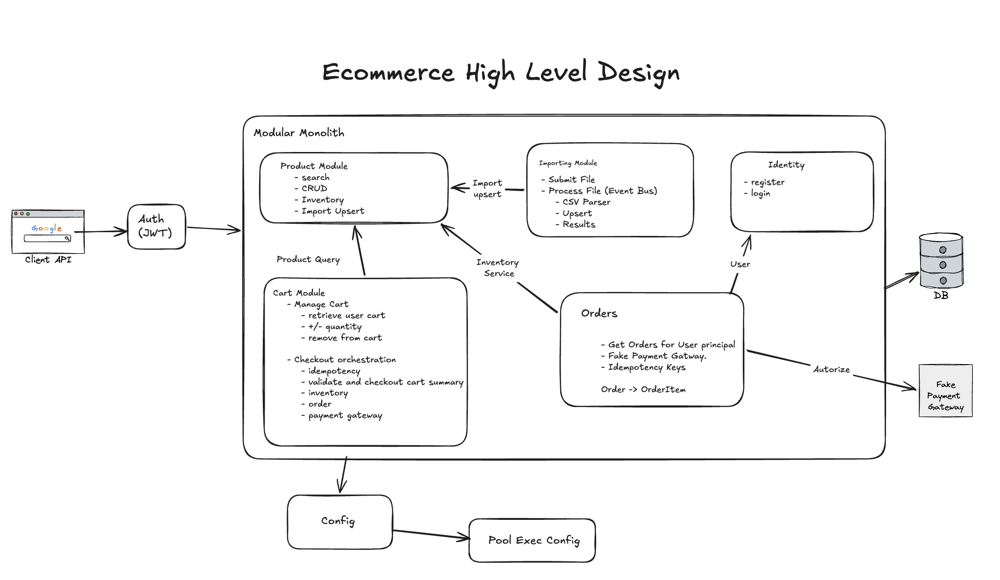
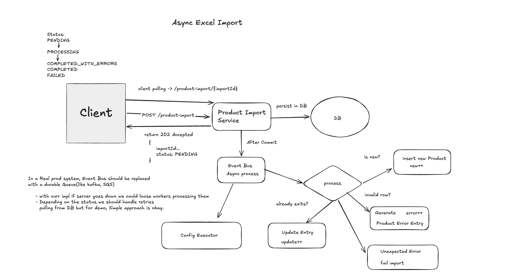

# Ecommerce Design

## Functional Req:
    - Create, update, retrieve and delete products
    - Search products by name and category
    - Import products from CSV
    - Add, update, and remove cart items
    - Check out a cart
    - View created orders
    
## Non Functional Req:
    - Consistency for Purchase, import csv and create.
    - Performance

## Consistency Requirements

- Product SKUs are unique
- Inventory cannot become negative
- A cart can produce at most one order
- Reusing an idempotency key returns the same order
- Each user has at most one active cart
- Order items preserve Snapshots (product information and price used at checkout)
- Inventory updates are performed atomically in the database


## Performance
- CSV processing does not block the HTTP request thread
- Product search uses cursor-based pagination


# Entities

### Core Entities
    - Product:
        - sku
        - name
        - description
        - category
        - price
        - stock
        - weightKg
        - imageUrl?
        - createdAt
        - updatedAt
        - active (soft delete)
    
    - Product Import (CSV)
        - id (PK)
        - filename
        - file
        - status: [PENDING, PROCESSING, COMPLETED, COMPLETED_WITH_ERRORS, FAILED]
        - createdCount
        - updateCount
        - rejectedCount
        - submittedAt
        - Errors: [importId(FK) row, sku, reason]
    
    - Cart
        - id
        - userId (fk)
        - cartStatus: [ACTIVE, CHECKOUT]
        - createdAt
        - updatedAt
        - version (optimistic locking)
        - items:
            - Cart Items:
                - id
                - cart_id
                - product_id
                - quantity
    
    - Order
        - id
        - cartId(fk)
        - userId(fk)
        - status: [PENDING_PAYMENT, CONFIRMED]
        - total
        - paymentReference
        - createdReference
        - idempotency key (prevent dup checkouts)
        - Address
        - orderItems (OrderItems):
            - id
            - orderId(fk)
            - productId
            - sku
            - productName
            - unitPrice
            - quantity
            - lineTotal
    
    - User
        - id
        - email
        - enabled
        - Address
        - createdAt
        - updatedAt
        - roles: [userRoles]

    - UserRoles
        - Role
        - user_id(FK)
    
    - @Auth simple (JWT Access_token) 
        - principalUserId -> userId from JWT subject

### Database Contraints
```
products.sku
    UNIQUE

cart_items(cart_id, product_id)
    UNIQUE

orders(user_id, idempotency_key)
    UNIQUE

orders.cart_id
    UNIQUE
```

### Value Objects
    - Money
    - Sku
    - ProductCategory
    - Address

## API DESIGN -> **/api/v1/**


### Products:

```
Public Endpoints: 

GET /products?q={name}&category={category}&limit={20}&cursor={nextCursor=base64(lastname|lastproductId)} | search products

GET /products/{productId} | Get an active product

GET /categories — List active categories

Admin Ops

POST /products
body: CreateProduct | Create a product request | Role=Admin

PUT /products/{productId} 
body: UpdateProduct | update product request | Role=Admin

DELETE /products/{productId} Soft-delete a product | Role=Admin

```

### Product Import:

```
POST /product-imports — Submit one multipart CSV | Role=Admin
Body: CSV File

GET /product-imports/{importId} — Import status, counts, and rejected rows etc.. | Role=Admin

```

### Cart:
```
@Auth -> userId

POST /carts — Create or retrieve the demo user active cart | Role=Customer

GET /carts/{cartId} — Get the current cart and product details | Role=Customer

PUT /carts/{cartId}/items/{productId} | Role=Customer
Body: UpdateCartItem -> {"quantity":10}
— set a quantity for product

DELETE /carts/{cartId}/items/{productId} — Remove an item from the cart | Role=Customer


POST /carts/{cartId}/checkout —  | Role=Customer
Header: Idempotency-Key -> generated by client to prevent
double checkouts with the same items.

```

### Orders:
just for demo porpuse to show purchases made a real system, will need to handle
shipping or more logistic details etc...

```
@Auth -> userId

GET /orders/{orderId} — Get Order By id | Role=Customer

GET /orders — List of Orders on user | Role=Customer

```

# High Level Design




Modules:

- Product:
- Importing:
- Cart
- Order
- Identify: Fake @Auth


# Deep Dives

## Excel Processing (Diagram)



### File Processing

-  strict file with just the 7 Expected Headers.
    - Rules:
        - Price and Weight must be valid Numeric and not be negative
        - Stock non Negative Integer, Zero is Valid
        - Sku must be unique.
        - Existing Sku are updated. 
        - Sku that are not in system and valid create a new product
        
CSV contains SQL injection Values:
    - SQL is prevented at JPA.
    - XSS is prevented at rendering with react.


## Check out flow

1) Search for an existing order using userId + idempotencyKey.
2) if present checkout request return Order
3) validate Cart
4) Read current product prices and make checkout summary.
5) Decrement Inventory in a Single Unit of work.
6) Create the order and orderitems snapshots.
7) autorize Payment
8) confirm order and complete checkout

*** ALl operations are under the same transaction***
if one fails all rollback is perform aplying single unit of work.


Checkout expect a Idempotency-key.
this will generate a Order with pending_payment 
and the checkout summary. After the payment gateway returns
confirmation. THe order becomes CONFIRM and Cart CHECKOUT.
Reusing the same Idempotency-Key returns existing order
    - if the checkout is already in progress we return a conflict (optimistic locking for checkout)


Carts has no expiration, so if a user has old price, check out might show different results on screen
ideally you should notify of a product price change, we just handle the case if it is out of stock. for simple demo, I think it might not be necessary.


### Search
 - for simplicity for search we are unsing LIKE %q%.
    - this scans every row on the DB at scale. Text Search index or a dedicated DB like Elastic

Cursor Pagination.
    - I have decided to use a simple cursor pagination to avoid loading all product at once.


## Authentication:

- For simplicty we have an intial admin with defaults creds to show admin panels(product and imports)
- Customer could read catalog but to initiate a purchase login is required. typically you will need to handle local cart and then reconciliate with backend for simplicity, I will make login required and let backend handle cart state.
- When Register User are required to add address this will be the default shipping address. User could update shipping address but for simplicity this is not added here. 
- For now same Form is used for Login Admin and Customer users. 

### Front End
- routes.ts: holds routes for spa
- services: http service to ecommerce-api
- hooks: reusable component for product import (submit, polling(2000ms)) and product (Categories, Pagination etc..)
- pages: Main Pages for spa
- Cart context: Manage Cart Operations in a context to preserve them(local storage). Auth (Context) manage auth related operations login, register, isAuthenticated, and role. Right now Auth details are storaged in local storage for prod, use http cookie or in memory.
- components: re-usable components for the pages (product, auth, order).


# How to Run the project locally

## Proyect structure
**ROOT:**
- ecommerce-api
        - Spring boot App:
            - module domain:
                - output, domain, services, repository
            - config:
                - security
                - Pools
            - shared:
                - exceptions
                - valueObjects

            - JPA, H2 or Postgress, Hibernate, JAVA 21, Spring boot 4.1.
        - DockerFile
- ecommerce-client:
        - React + Vite App
            - React Router Dom + React Context
        - DockerFile

- Compose provisionates for back and front end
        - check on healthy service dependencies


### To Run it with Local DB (H2)
```
docker compose up --build

```


### With Postgress
too run with postgress

```
docker compose -f compose.yaml -f compose.postgres.yaml up --build
```

## Open client or swagger

```
Frontend:
http://localhost:3000

Swagger:

http://localhost:8080/swagger-ui/index.html
```


Commands:

```
docker compose ps
```
Shows running services.

```
docker compose logs -f api
```

Shows backend logs.

```
docker compose logs -f client
```
Shows clientlogs.

```

docker compose down

```

Stops everything.